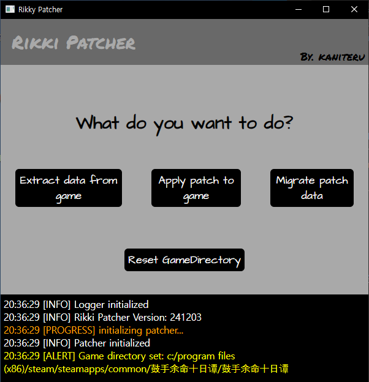

# Rikki Patcher
A simple patch tool to modify the game《 [鼓手余命十日谭 (Shiina Taki's Decameron)](https://store.steampowered.com/app/3269960) 》

## Features
- Extract and apply modified dialogue, some ui texts
- Apply custom data (copy custom data into game)

## Download
[Download](https://kaniteru.github.io/project/rikkipatcher/index.html?section=download)

## Usage
[Usage](https://kaniteru.github.io/project/rikkipatcher/index.html?section=usage)

[Translation Patches Repo](https://github.com/kaniteru/RikkiPatcher-Patches)

## Branches Info
- **main**: The latest release source
- **develop**: The development and testing source

## Todo
- Support for multiple languages in the client
- Improve 'Migrate patch data'
- Async worker

## Third-Party Software
This project includes the 7-Zip executable, which is licensed under the GNU Lesser General Public License (LGPL).
 
For more information,
visit the [7-Zip website](https://www.7-zip.org/) and the [LGPL license](https://www.gnu.org/licenses/lgpl-3.0.en.html).

## License
This project is licensed under the GNU General Public License (GPL) - see the [LICENSE](LICENSE) file for details.